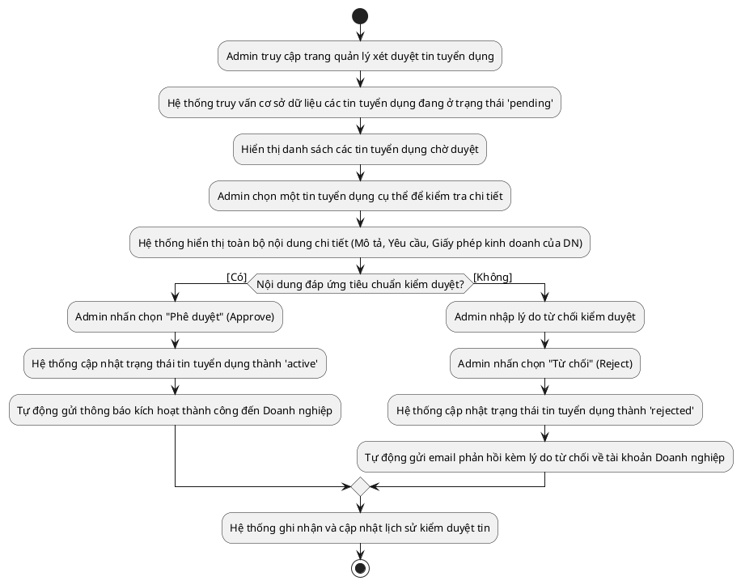

# Sơ đồ Hoạt động - Luồng Xét duyệt nội dung của Quản trị viên (Admin)

```plantuml
@startuml
skinparam defaultFontName "SansSerif"
skinparam defaultFontSize 13

start
:Admin truy cập trang quản lý xét duyệt tin tuyển dụng;
:Hệ thống truy vấn cơ sở dữ liệu các tin tuyển dụng đang ở trạng thái 'pending';
:Hiển thị danh sách các tin tuyển dụng chờ duyệt;
:Admin chọn một tin tuyển dụng cụ thể để kiểm tra chi tiết;
:Hệ thống hiển thị toàn bộ nội dung chi tiết (Mô tả, Yêu cầu, Giấy phép kinh doanh của DN);

if (Nội dung đáp ứng tiêu chuẩn kiểm duyệt?) then ([Có])
  :Admin nhấn chọn "Phê duyệt" (Approve);
  :Hệ thống cập nhật trạng thái tin tuyển dụng thành 'active';
  :Tự động gửi thông báo kích hoạt thành công đến Doanh nghiệp;
else ([Không])
  :Admin nhập lý do từ chối kiểm duyệt;
  :Admin nhấn chọn "Từ chối" (Reject);
  :Hệ thống cập nhật trạng thái tin tuyển dụng thành 'rejected';
  :Tự động gửi email phản hồi kèm lý do từ chối về tài khoản Doanh nghiệp;
endif

:Hệ thống ghi nhận và cập nhật lịch sử kiểm duyệt tin;
stop
@enduml
```
