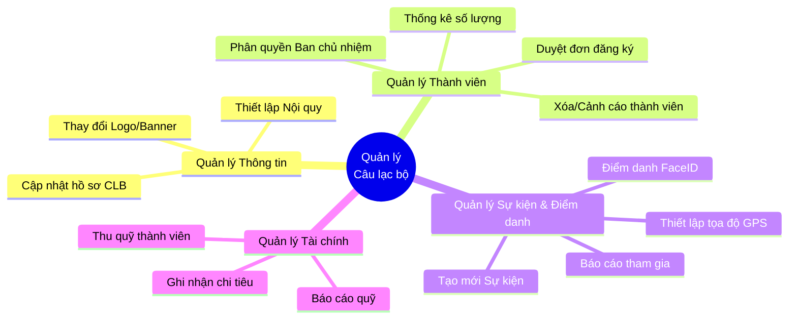
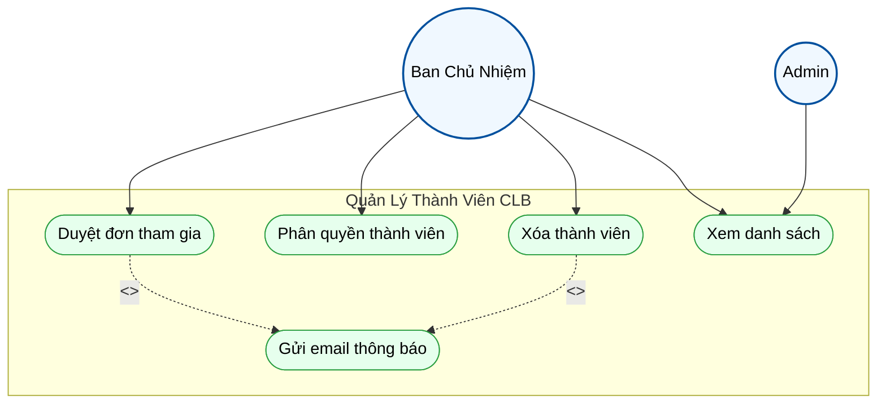
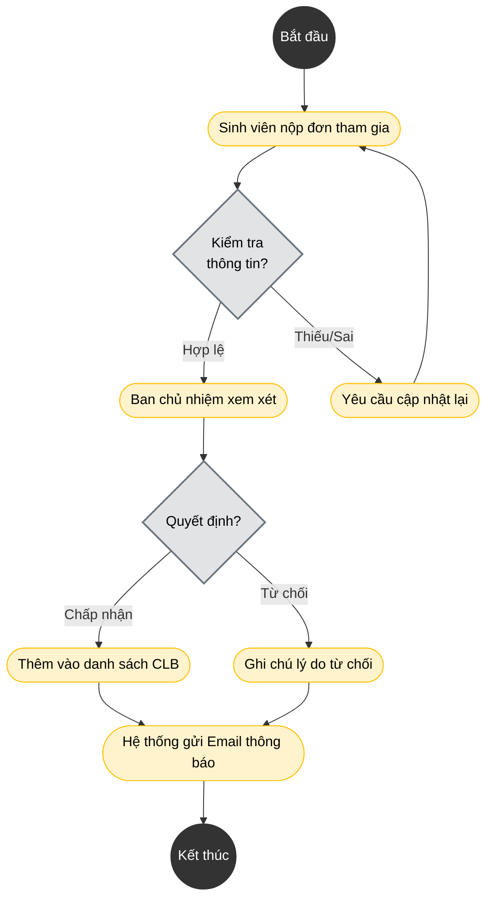
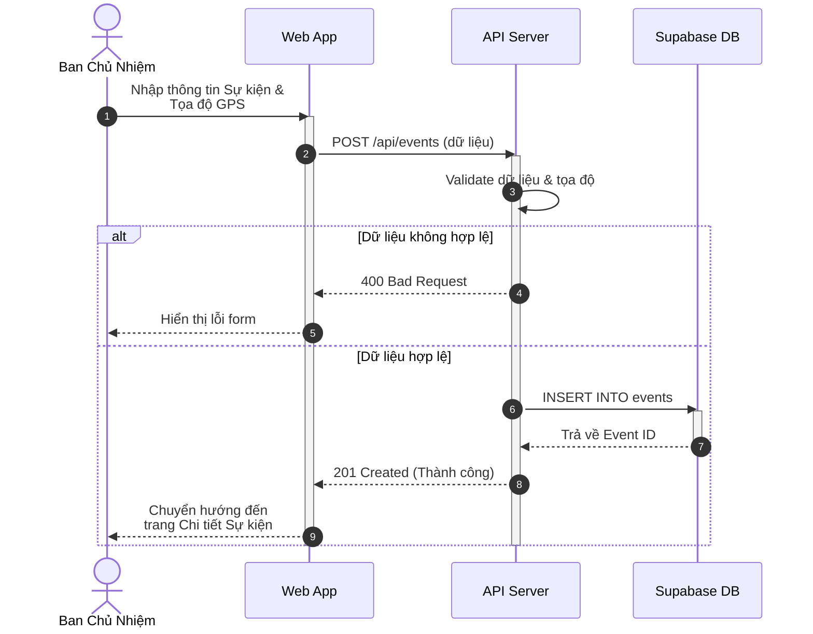

# Kế Hoạch Vẽ Sơ Đồ Mermaid Cho Phân Hệ Quản Lý Câu Lạc Bộ (Draw.io - Khổ A4)

Khác với 3 file mẫu sử dụng PlantUML mang phong cách cổ điển, kế hoạch này sử dụng **Mermaid.js** với cú pháp được tinh chỉnh tối ưu cho **Draw.io**. Để đảm bảo vừa vặn trên trang Word A4 (chiều ngang giới hạn) và có UI hiện đại, chúng ta sẽ áp dụng các nguyên tắc sau:
1. **Hướng bố cục (Direction):** Ưu tiên dùng `TD` (Top-Down) cho Use Case/Phân rã để tránh phình chiều ngang, và phân tách các luồng dài trong Sequence/Activity.
2. **Hình khối (Shapes):** Thay vì hình chữ nhật mặc định, sử dụng bo góc `([ ])`, hình thoi `{ }`, hoặc hình trụ `[( )]` để tạo sự khác biệt.
3. **Màu sắc (Theming):** Sử dụng `classDef` với các mã màu Pastel hiện đại (Modern UI) thay vì đen trắng/xám mặc định.

---

## 1. Sơ Đồ Phân Rã Chức Năng (Functional Decomposition Diagram)
*Mục đích: Chia nhỏ phân hệ "Quản lý Câu lạc bộ" thành các nhóm nghiệp vụ.*

**Code Mermaid (Copy dán vào tính năng Insert -> Advanced -> Mermaid của Draw.io):**

*(Lưu ý: Draw.io hỗ trợ cú pháp `mindmap` của Mermaid rất tốt cho sơ đồ phân rã chức năng, giúp tự động co giãn và dàn trang tròn trịa, rất hợp với khổ dọc A4).*

---

## 2. Kế Hoạch Chi Tiết Cho Sơ Đồ Use Case (Usecase Diagram)
*Để không bị tràn viền A4, ta sẽ nhóm theo các `subgraph` dọc.*

**Cấu trúc thiết kế:**
- **Actor:** `Admin` (Quản trị hệ thống) và `ClubLeader` (Ban chủ nhiệm CLB).
- **Layout:** `flowchart TD` (Từ trên xuống).
- **Styling:** Dùng `classDef` tô màu nền nhạt (Light Blue cho Actor, Light Green cho Usecase).

**Code Mermaid mẫu (Dành cho Quản lý Thành viên):**

---

## 3. Kế Hoạch Chi Tiết Cho Sơ Đồ Hoạt Động (Activity Diagram)
*Tối ưu A4: Các nhánh điều kiện (if/else) được dàn thẳng đứng thay vì rẽ ngang quá nhiều.*

**Cấu trúc thiết kế:**
- Luồng: **Quy trình duyệt đơn tham gia CLB của sinh viên**.
- Bắt đầu/Kết thúc: Sử dụng node chấm đen `(( ))`.
- Điều kiện: Hình thoi `{ }`.

**Code Mermaid mẫu:**

---

## 4. Kế Hoạch Chi Tiết Cho Sơ Đồ Tuần Tự (Sequence Diagram)
*Sequence Diagram rất dễ bị tràn chiều ngang trên A4. Cần giới hạn số lượng `participant` (tối đa 4-5) và dùng ` ` để ngắt dòng text.*

**Cấu trúc thiết kế:**
- Luồng: **Ban chủ nhiệm tạo sự kiện và thiết lập điểm danh GPS**.
- Sử dụng cú pháp tự động đánh số `autonumber`.
- Lược bỏ bớt các database nội bộ không cần thiết, tập trung vào Client - Controller - Service.

**Code Mermaid mẫu:**

## Hướng dẫn đưa vào Draw.io:
1. Mở trang Draw.io (app.diagrams.net).
2. Trên thanh menu, chọn **Arrange** -> **Insert** -> **Advanced** -> **Mermaid...**
3. Dán đoạn code Mermaid ở trên vào hộp thoại và bấm **Insert**.
4. Chọn khối vừa tạo, bạn có thể thay đổi kích thước dễ dàng để căn giữa vừa vặn với trang giấy A4 (Kích thước A4 chuẩn trong Draw.io là 827x1169 pixels).
