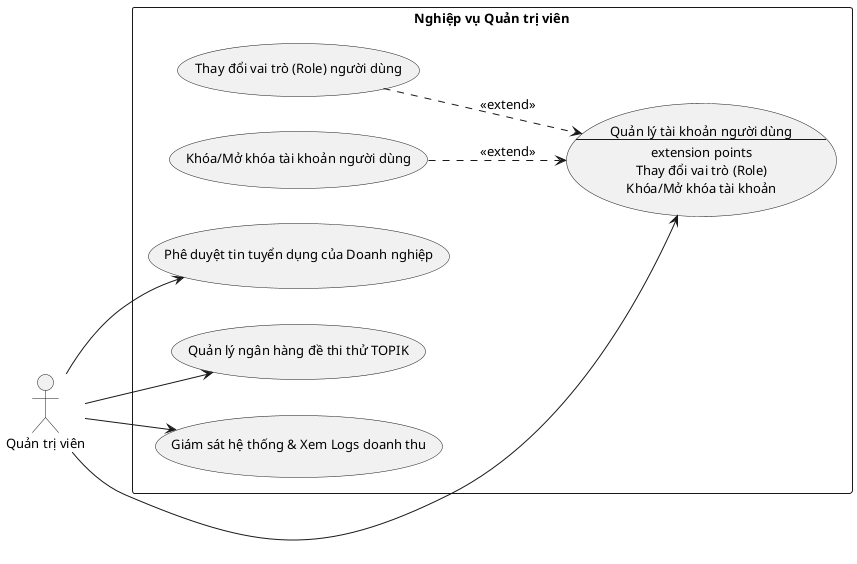

# Sơ đồ Use Case Phân rã Chức năng - Nghiệp vụ Quản trị viên (Admin)

```plantuml
@startuml
left to right direction
skinparam defaultFontName "SansSerif"
skinparam defaultFontSize 13
skinparam packageStyle rectangle

actor "Quản trị viên" as Admin

rectangle "Nghiệp vụ Quản trị viên" {
  usecase UC_ManageUsers as "Quản lý tài khoản người dùng
--
extension points
Thay đổi vai trò (Role)
Khóa/Mở khóa tài khoản"

  usecase UC_ChangeRole as "Thay đổi vai trò (Role) người dùng"
  usecase UC_BlockUser as "Khóa/Mở khóa tài khoản người dùng"
  usecase UC_ApproveJob as "Phê duyệt tin tuyển dụng của Doanh nghiệp"
  usecase UC_ManageTOPIKTest as "Quản lý ngân hàng đề thi thử TOPIK"
  usecase UC_SystemMonitoring as "Giám sát hệ thống & Xem Logs doanh thu"
}

Admin --> UC_ManageUsers
Admin --> UC_ApproveJob
Admin --> UC_ManageTOPIKTest
Admin --> UC_SystemMonitoring

UC_ChangeRole ..> UC_ManageUsers : <<extend>>
UC_BlockUser ..> UC_ManageUsers : <<extend>>
@enduml
```
