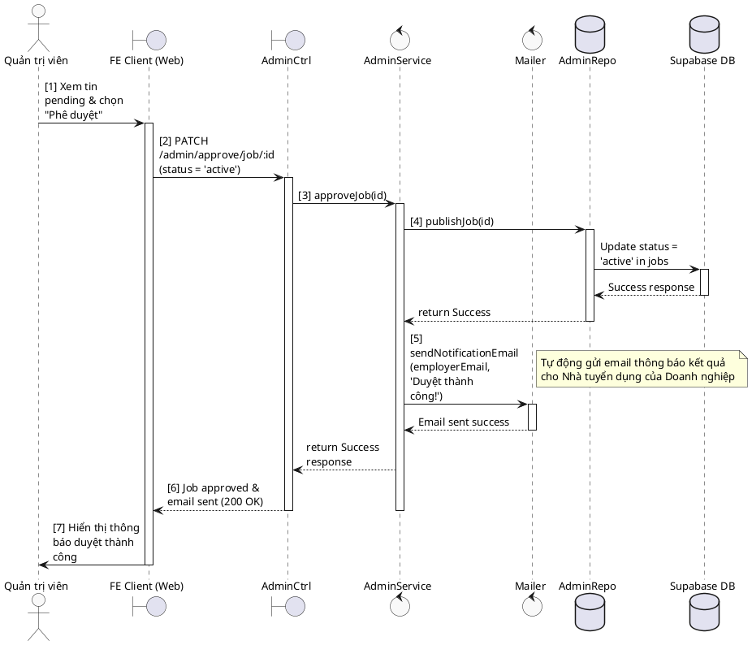

# Sơ đồ tuần tự - Luồng Quản trị viên (Admin) Phê duyệt tin tuyển dụng

```plantuml
@startuml
skinparam defaultFontName "SansSerif"
skinparam defaultFontSize 13
skinparam ActorBackgroundColor #F9F9F9
skinparam ControlBackgroundColor #F9F9F9
skinparam maxMessageSize 120
skinparam ParticipantPadding 8
skinparam BoxPadding 8

actor "Quản trị viên" as Admin
boundary "FE Client (Web)" as FE
boundary "AdminCtrl" as Ctrl
control "AdminService" as Serv
control "Mailer" as Mail
database "AdminRepo" as Repo
database "Supabase DB" as DB

Admin -> FE : [1] Xem tin pending & chọn "Phê duyệt"
activate FE
FE -> Ctrl : [2] PATCH /admin/approve/job/:id\n(status = 'active')
activate Ctrl
Ctrl -> Serv : [3] approveJob(id)
activate Serv

Serv -> Repo : [4] publishJob(id)
activate Repo
Repo -> DB : Update status = 'active' in jobs
activate DB
DB --> Repo : Success response
deactivate DB
Repo --> Serv : return Success
deactivate Repo

Serv -> Mail : [5] sendNotificationEmail\n(employerEmail, 'Duyệt thành công!')
activate Mail
note right: Tự động gửi email thông báo kết quả\ncho Nhà tuyển dụng của Doanh nghiệp
Mail --> Serv : Email sent success
deactivate Mail

Serv --> Ctrl : return Success response
Ctrl --> FE : [6] Job approved & email sent (200 OK)
deactivate Serv
deactivate Ctrl
FE -> Admin : [7] Hiển thị thông báo duyệt thành công
deactivate FE
@enduml
```
